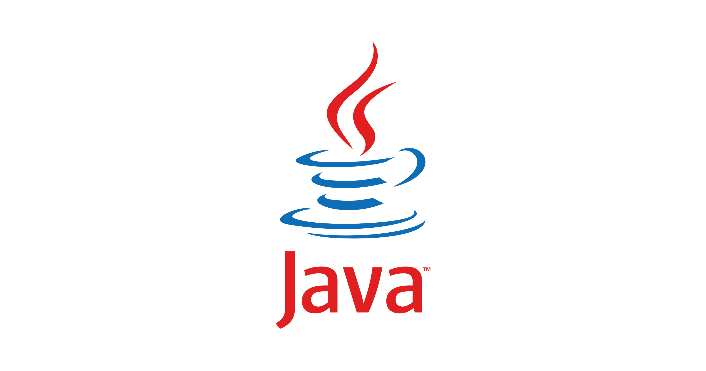
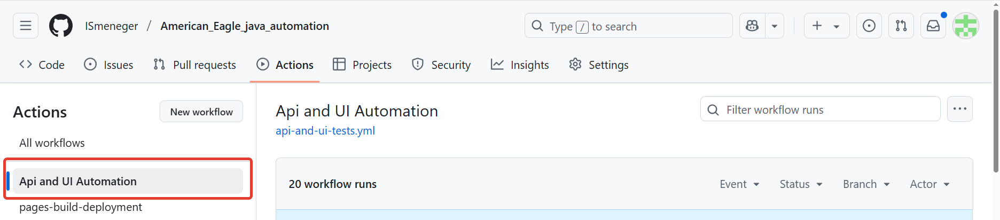
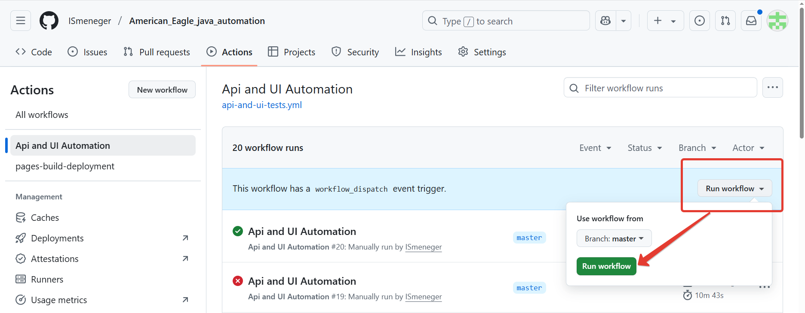
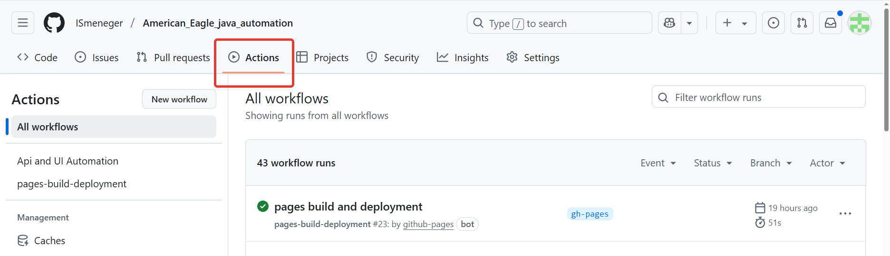
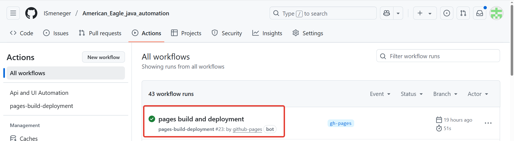
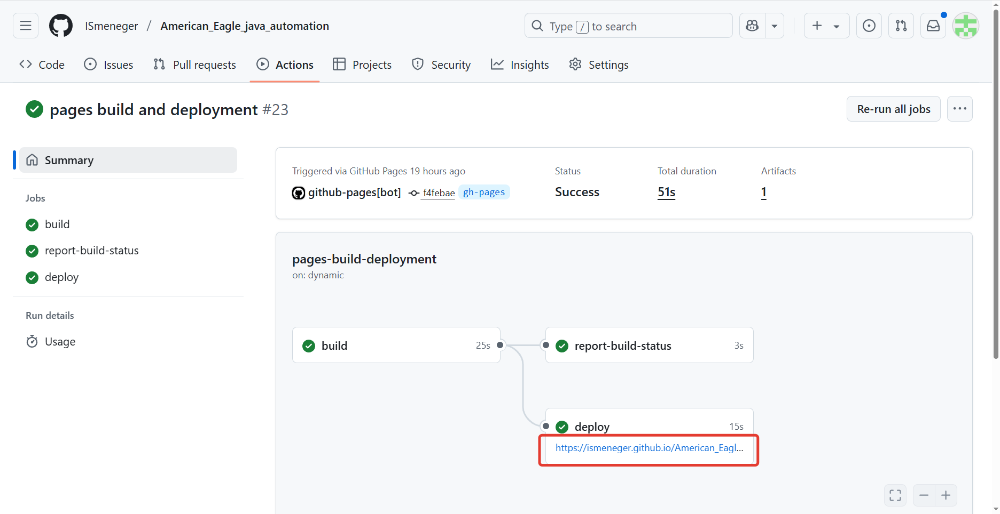
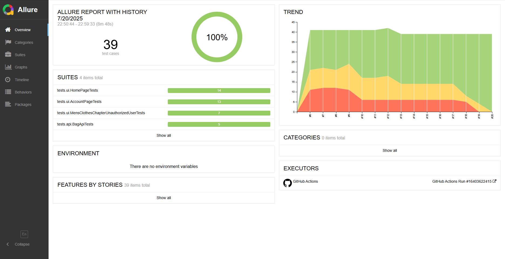
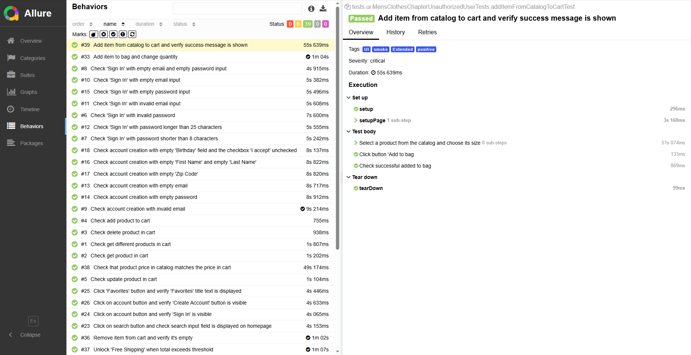

#  American Eagle Java Automation Test Project

## 🧪 Дипломный проект: Автоматизация тестирования сайта  [American Eagle](https://www.ae.com/us/en)

Автоматизация UI и API тестирования сайта **American Eagle** с использованием **Java**, **Selenium**, **REST Assured**, **JUnit 5** и **GitHub Actions**.

[](https://www.java.com/)
[](https://gradle.org/)
[](https://junit.org/junit5/)
[](https://www.selenium.dev/)
[](https://github.com/features/actions)
[](https://allurereport.org/)

## 📌 Описание проекта

Этот репозиторий содержит **автоматизированные UI и API тесты** для сайта [American Eagle](https://www.ae.com), разработанные в рамках дипломного проекта.  
Проект направлен на обеспечение качества пользовательского интерфейса и бизнес-логики.

##  🗂  Проект включает:

- Автоматизированные сценарии пользовательского интерфейса (UI)

- API-тесты для проверки бизнес-логики и взаимодействия с backend

- Использование инструментов: Selenium, JUnit 5, Gradle, GitHub Actions


| Инструмент                                                                                       | Назначение                                |
| ------------------------------------------------------------------------------------------------ | ----------------------------------------- |
|                          | Сборка проекта и управление зависимостями |
|                              | Фреймворк для написания и запуска тестов  |
|                   | UI-тестирование веб-интерфейса            |
|  | Автоматический запуск тестов (CI/CD)      |
| **REST Assured**                                                                                 | Автоматизация API тестирования            |
| **Allure Reports**                                                                               | Формирование наглядных тест-отчётов       |

---

## 📚 Содержание
- [🧰 Технологический стек](#-технологический-стек)

- [🚀 Запуск тестов](#-запуск-тестов)

- [⚙️ Запуск в GitHub Actions](#-запуск-в-github-actions)

- [📊 Allure отчет в GitHub Actions](#-allure-отчет-в-github-actions)

---

## 🧰 Технологический стек

<p align="center"> 
  <a href="https://www.jetbrains.com/idea/" rel="nofollow"></a>
  <a href="https://www.java.com/" rel="nofollow"></a>
  <a href="https://rest-assured.io/" rel="nofollow"></a>
  <a href="https://gradle.org/" rel="nofollow"></a>
  <a href="https://junit.org/junit5/" rel="nofollow"></a>
  <a href="https://www.selenium.dev/" rel="nofollow"></a>
  <a href="https://github.com/" rel="nofollow"></a>
  <a href="https://github.com/features/actions" rel="nofollow"></a>
<a href="https://allurereport.org/" rel="nofollow"></a>
</p>

- Язык: Java 17

- Фреймворк тестирования: JUnit 5

- UI тесты: Selenium WebDriver

- API тесты: REST Assured

- Сборщик: Gradle

- Шаблон проектирования: Page Object Model (POM)

- Генерация моделей: Lombok

- Отчетность: Allure Report

- CI/CD: GitHub Actions + GitHub Pages

Allure отчет включает:

- Пошаговое выполнение тестов

- Скриншоты и исходный код страницы при падениях

- Отметки по severity, tags и owner

---

## 🚀 Запуск тестов
📌 **Перед запуском** локально заполните `email` и `password` в файле `default.properties`:
#### Пример использования:

- email=your_email@example.com
- password=your_password

## 🔧 Команды для запуска:

| Тип тестов                   | Команда                                                                                  |
|------------------------------|------------------------------------------------------------------------------------------|
| **1. Все (без дефектных)**   | `gradle allExceptDefect`                                                                 |
| **2. Только smoke-тесты**    | `gradle smoke`                                                                           |
| **3. Только API**            | `gradle apiTests`                                                                        |
| **4. Только UI**             | `gradle uiTests`                                                                         |
| **5. Только defect-тесты**   | `gradle defect`                                                                          |
| **6. Полный запуск**         | `gradle test`                                                                            |
| **7. Удалённый запуск (CI)** | `./gradlew allExceptDefectRemote -Denv=default -Demail=EMAIL_INPUT -Dpassword=PASSWORD_INPUT` |

1.
```bash
   gradle allExceptDefect
```
2. 
```bash
    gradle smoke
```
3. 
```bash
   gradle apiTests
```
4.
```bash
   gradle uiTests
```
5. 
```bash
   gradle defect
```
6. 
```bash
   gradle test
```
7. 
```bash
   ./gradlew allExceptDefectRemote -Denv=default -Demail=EMAIL_INPUT -Dpassword=PASSWORD_INPUT
```

- ✅ Все команды запускаются из корня проекта.
- 📦 Используется Gradle Wrapper (./gradlew), глобальный Gradle не требуется.

---

## ⚙️ Запуск в GitHub Actions
1. Перейдите в репозиторий **[American_Eagle_java_automation](https://github.com/ISmeneger/American_Eagle_java_automation/actions)**

2. Откройте вкладку `Actions`

<p align="center">  </p>

3. Выберите workflow `Api and UI Automation`

<p align="center">  </p>

4. Нажмите `Run workflow`

<p align="center">  </p>

5. Дождитесь завершения выполнения тестов

---

## 📊 Allure отчет в GitHub Actions
1. После завершения сборки перейдите снова во вкладку **[Actions](https://github.com/ISmeneger/American_Eagle_java_automation/actions)**

<p align="center">  </p>

2. Откройте раздел `pages build and deployment`

<p align="center">  </p>

3. Перейдите по ссылке на **[Allure](https://ismeneger.github.io/American_Eagle_java_automation/20/index.html#)** отчет

<p align="center">  </p>

4. Изучите отчет `Allure`

<p align="center">  </p>

<p align="center">  </p>

## 🧩 Дополнительно
✅ Реализовано логическое разделение по типам тестов (UI, API, smoke, defect)

✅ Используется шаблон Page Object Model (POM)

✅ Настроены теги @Tag для гибкой фильтрации тестов

✅ Поддержка CI/CD и Allure отчётности

