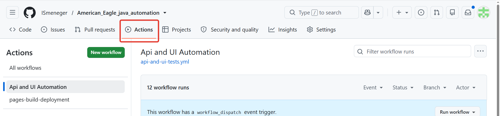
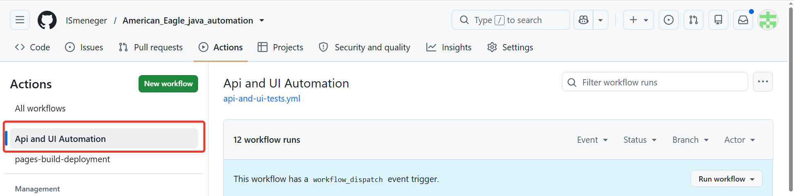
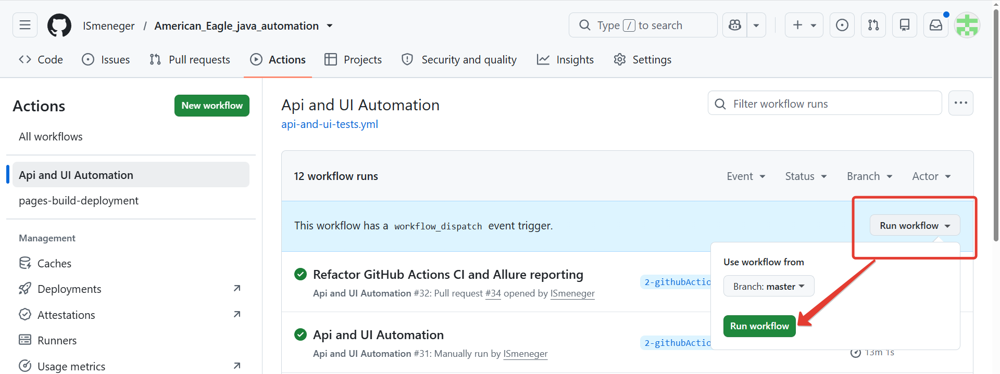
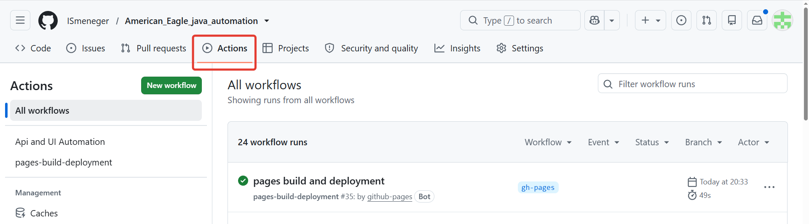
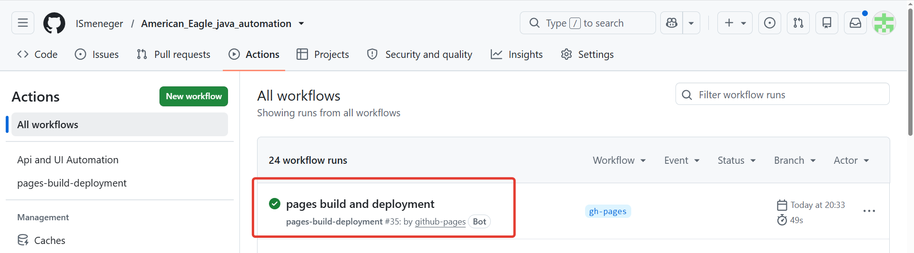
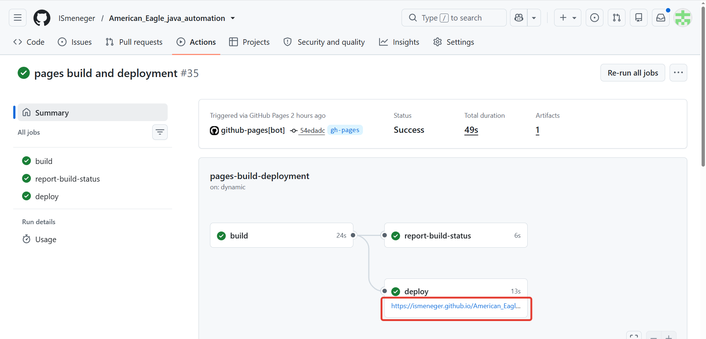
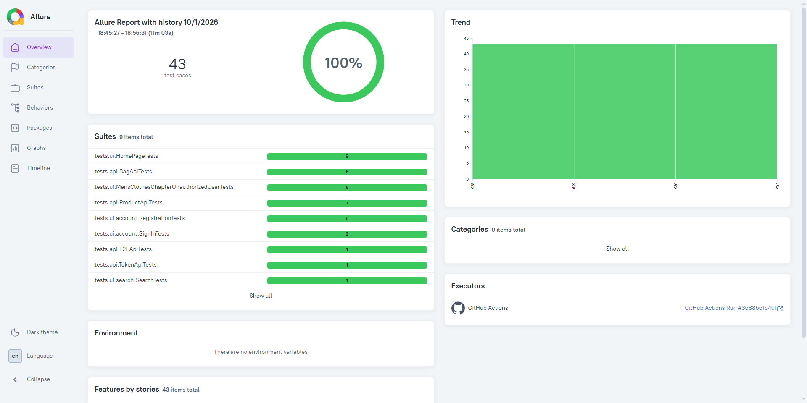

# American Eagle Java Automation

## 🧪 UI & API Test Automation Project

Автоматизированное тестирование реального e-commerce сайта [American Eagle](https://www.ae.com/us/en) с использованием **Java 21**, **Selenium WebDriver**, **REST Assured**, **JUnit 5**, **Gradle**, **GitHub Actions** и **Allure Report**.

[](https://www.java.com/)
[](https://junit.org/junit5/)
[](https://www.selenium.dev/)
[](https://rest-assured.io/)
[](https://gradle.org/)
[](https://github.com/features/actions)
[](https://allurereport.org/)

### 📊 Live Allure Report

➡️ **[Open Allure Report](https://ismeneger.github.io/American_Eagle_java_automation/)**

---

<a id="contents"></a>
## 📚 Содержание

- [📌 О проекте](#project)
- [🛍 Об объекте тестирования](#system-under-test)
- [🧰 Технологический стек](#tech-stack)
- [🏗 Архитектура проекта](#architecture)
- [✅ Покрытие](#coverage)
- [⚠️ Ограничения и anti-bot protection](#limitations)
- [📝 Тест-план](#test-plan)
- [🏷 Теги тестов](#tags)
- [🚀 Локальный запуск](#local-run)
- [🔐 Credentials](#credentials)
- [⚙️ GitHub Actions](#github-actions)
- [📊 Allure Report](#allure)
- [📦 Allure artifacts](#artifacts)
- [🧪 API E2E сценарий](#api-e2e)
- [📁 Структура проекта](#project-structure)
- [📈 CI/CD результат](#cicd-result)
- [👤 Author](#author)

---

<a id="project"></a>
## 📌 О проекте

Этот репозиторий содержит **автоматизированные UI и REST API тесты** для сайта [American Eagle](https://www.ae.com/).

Проект первоначально был разработан в рамках дипломной работы по автоматизации тестирования и в дальнейшем развивается как практический **Java AQA pet project**.

Основные цели проекта:

- автоматизация пользовательских UI-сценариев;
- автоматизация REST API тестирования;
- проверка позитивных и негативных сценариев;
- реализация API E2E-сценариев;
- разделение тестов по типам и тегам;
- работа с динамическими тестовыми данными;
- автоматический запуск тестов в GitHub Actions;
- раздельный запуск API и UI наборов;
- формирование единого Allure Report;
- публикация тестовой отчётности через GitHub Pages.

[⬆️ К содержанию](#contents)

---

<a id="system-under-test"></a>
## 🛍 Об объекте тестирования

**American Eagle Outfitters, Inc. (American Eagle)** — крупная американская розничная компания по продаже одежды и аксессуаров.

Компания была основана в **1977 году** и развивает несколько розничных брендов, включая **American Eagle** и **Aerie**.

Для автоматизации выбран реальный действующий интернет-магазин:

➡️ [https://www.ae.com/](https://www.ae.com/)

С точки зрения автоматизации тестирования это сложный e-commerce продукт, который включает:

- большой каталог товаров и категорий;
- поиск и рекомендации товаров;
- карточки товаров с различными SKU;
- регистрацию и авторизацию пользователей;
- пользовательские сессии;
- корзину и изменение её состояния;
- REST API;
- динамический контент;
- всплывающие окна и маркетинговые элементы;
- взаимодействие UI и backend;
- anti-bot protection;
- различия поведения сайта при локальном и удалённом запуске.

Работа с production-сайтом позволяет проверять не только отдельные элементы интерфейса, но и реальные пользовательские и API-сценарии, а также решать типичные для Automation QA задачи: синхронизацию, нестабильность внешнего окружения, динамические данные, управление состояниями и интеграцию автотестов с CI/CD.

[⬆️ К содержанию](#contents)

---

<a id="tech-stack"></a>
## 🧰 Технологический стек

| Технология | Назначение |
|---|---|
| **Java 21** | Основной язык проекта |
| **JUnit 5** | Тестовый фреймворк |
| **Selenium WebDriver 4.33.0** | UI-автоматизация |
| **REST Assured** | REST API тестирование |
| **AssertJ** | Fluent assertions |
| **Awaitility 4.3.0** | Ожидание eventual consistency в API |
| **Gradle 8.10** | Сборка и управление зависимостями |
| **Owner** | Работа с конфигурацией |
| **Allure Report** | Тестовая отчётность |
| **Git / GitHub** | Контроль версий |
| **GitHub Actions** | CI |
| **GitHub Pages** | Публикация Allure Report |
| **Selenium Standalone Chrome** | Удалённый запуск UI-тестов в CI |
| **IntelliJ IDEA** | Среда разработки |

[⬆️ К содержанию](#contents)

---

<a id="architecture"></a>
## 🏗 Архитектура проекта

В проекте используются:

- **Page Object Model** для UI-тестов;
- отдельные Page и Component классы;
- Controller-подход для API;
- DTO-модели для API-ответов;
- JUnit 5 Extensions;
- конфигурация через Owner;
- Allure annotations (`@Step`, `@Severity`);
- JUnit tags для гибкого запуска тестовых наборов;
- отдельные Steps / Support / Utils слои;
- Gradle tasks для запуска отдельных категорий тестов.

Основные категории тестов:

- `UI`
- `API`
- `smoke`
- `positive`
- `negative`
- `E2E`
- `defect`

[⬆️ К содержанию](#contents)

---

<a id="coverage"></a>
## ✅ Покрытие

### UI

В UI-части проекта проверяются:

- главная страница и header;
- навигационные элементы;
- поиск;
- авторизация;
- заполнение регистрационной формы;
- доступность элементов регистрации;
- разделы каталога;
- пользовательские сценарии взаимодействия с сайтом.

### API

API-набор включает проверки:

- получение guest token;
- Product API;
- Bag API;
- добавление товара в корзину;
- изменение количества;
- удаление товара;
- добавление нескольких разных товаров;
- позитивные и негативные сценарии;
- полный E2E lifecycle корзины.

Для сценариев, где состояние API может обновляться не мгновенно, используется **Awaitility** с bounded polling вместо фиксированных `sleep`.

[⬆️ К содержанию](#contents)

---

<a id="limitations"></a>
## ⚠️ Ограничения реального сайта и anti-bot protection

Тесты выполняются на **реальном production-сайте American Eagle**, который использует anti-bot protection.

Из-за этого отдельные сценарии могут быть технически недоступны для стабильного автоматизированного выполнения.

### Регистрация

Сценарий создания аккаунта автоматизирован, включая заполнение регистрационной формы и подготовку к отправке. Финальная отправка формы может блокироваться anti-bot-защитой сайта и приводить к `Access Denied`.

Поэтому тест успешной регистрации намеренно помечен `@Disabled` с пояснением причины:

```java
@Disabled(
        "Automated account creation is blocked by the site's anti-bot protection. " +
                "Registration form filling works, but submission results in Access Denied."
)
```

### Defect-сценарии

Тесты, которые зависят от ограничений сайта или известного нестабильного / изменившегося поведения, могут быть помечены:

```java
@Tag("defect")
```

Такие сценарии намеренно исключаются из основного CI-набора, чтобы ограничения внешнего production-сайта не делали основной pipeline нестабильным.

> В опубликованном Allure Report отображаются результаты активного CI-набора.
> `@Disabled` и исключённые `defect`-сценарии могут отсутствовать среди выполненных тестов — это ожидаемое поведение.

### Изменение поведения поиска

Negative-сценарий поиска без результатов был исключён из основного CI после изменения поведения сайта: American Eagle начал возвращать рекомендованные товары даже для бессмысленных поисковых запросов.

Сам сценарий сохранён в проекте и помечен `defect` для дальнейшего анализа.

[⬆️ К содержанию](#contents)

---

<a id="test-plan"></a>
## 📝 Тест-план

Для проекта подготовлен отдельный тест-план с описанием подхода к тестированию, объёма покрытия и основных тестовых сценариев.

📄 **[Открыть Test Plan (PDF)](src/test/resources/American_Eagle_TestPlan_2026.pdf)**

[⬆️ К содержанию](#contents)

---

<a id="tags"></a>
## 🏷 Теги тестов

Пример:

```java
@Tags({
        @Tag("API"),
        @Tag("E2E")
})
```

Теги позволяют запускать отдельные группы тестов без изменения тестового кода.

[⬆️ К содержанию](#contents)

---

<a id="local-run"></a>
## 🚀 Локальный запуск

Для Windows PowerShell:

### Все тесты без `defect`

```powershell
.\gradlew allExceptDefect
```

### Smoke

```powershell
.\gradlew smoke
```

### Positive

```powershell
.\gradlew positive
```

### Negative

```powershell
.\gradlew negative
```

### API

```powershell
.\gradlew apiTests
```

### UI

```powershell
.\gradlew uiTests
```

### E2E

```powershell
.\gradlew e2e
```

### Defect

```powershell
.\gradlew defect
```

### Стандартный Gradle test

```powershell
.\gradlew test
```

Для Linux/macOS:

```bash
./gradlew <task>
```

Глобально установленный Gradle не требуется — проект использует **Gradle Wrapper**.

[⬆️ К содержанию](#contents)

---

<a id="credentials"></a>
## 🔐 Credentials

Учётные данные не должны храниться непосредственно в репозитории.

Локально значения передаются через конфигурацию / системные параметры проекта.

В GitHub Actions используются GitHub Secrets:

- `EMAIL`
- `PASSWORD`

Пример запуска UI job:

```bash
./gradlew uiTests -Denv=default -Demail=$EMAIL_INPUT -Dpassword=$PASSWORD_INPUT
```

[⬆️ К содержанию](#contents)

---

<a id="github-actions"></a>
## ⚙️ GitHub Actions

Workflow разделён на независимые jobs:

```text
api-tests ──► api-allure-results ──┐
                                   ├──► allure-report ──► GitHub Pages
ui-tests ──► ui-allure-results ────┘
```

### `api-tests`

- поднимает Java 21;
- настраивает Gradle;
- запускает `./gradlew apiTests`;
- сохраняет `build/allure-results` как artifact `api-allure-results`.

### `ui-tests`

- поднимает Selenium Standalone Chrome;
- передаёт credentials через GitHub Secrets;
- запускает `./gradlew uiTests`;
- сохраняет `build/allure-results` как artifact `ui-allure-results`.

### `allure-report`

После завершения API и UI jobs:

1. скачивает `api-allure-results`;
2. скачивает `ui-allure-results`;
3. объединяет результаты;
4. восстанавливает историю предыдущих Allure-запусков;
5. формирует единый Allure Report;
6. публикует его в ветку `gh-pages`;
7. GitHub Pages делает отчёт доступным по постоянной ссылке.

### ▶️ Как запустить workflow вручную

1. Перейдите в репозиторий **[American_Eagle_java_automation](https://github.com/ISmeneger/American_Eagle_java_automation)**.
2. Откройте вкладку `Actions`.

<p align="center">
  
</p>

3. Выберите workflow `Api and UI Automation`.

<p align="center">
  
</p>

4. Нажмите `Run workflow` и выберите нужную ветку.

<p align="center">
  
</p>

5. Дождитесь завершения jobs:

```text
api-tests ✅
ui-tests  ✅
      ↓
allure-report ✅
```

[⬆️ К содержанию](#contents)

---

<a id="allure"></a>
## 📊 Allure Report

После завершения workflow результаты API и UI тестов объединяются в единый **Allure Report** и автоматически публикуются через **GitHub Pages**.

### ➡️ [**Open Allure Report**](https://ismeneger.github.io/American_Eagle_java_automation/)

В актуальном отчёте можно посмотреть:

- общий результат запуска;
- API и UI test suites;
- отдельные test cases;
- severity;
- tags;
- шаги выполнения тестов;
- ошибки и stack traces;
- attachments;
- историю запусков.

### 📌 Публикация отчёта

После публикации отчёта GitHub создаёт deployment через GitHub Pages.

<p align="center">
  
</p>

Откройте успешный `pages build and deployment`:

<p align="center">
  
</p>

В успешном deployment доступна ссылка на опубликованный отчёт:

<p align="center">
  
</p>

### 📈 Пример Allure Report

<p align="center">
  <a href="https://ismeneger.github.io/American_Eagle_java_automation/">
    
  </a>
</p>

> Нажмите на изображение, чтобы открыть актуальный Allure Report.
> Отчёт постоянно обновляется, поэтому актуальные результаты рекомендуется смотреть по ссылке **Open Allure Report** выше.

[⬆️ К содержанию](#contents)

---

<a id="artifacts"></a>
## 📦 Allure artifacts

Каждый запуск GitHub Actions отдельно сохраняет:

- `api-allure-results`
- `ui-allure-results`

Это позволяет не смешивать выполнение тестов в одном job и при этом формировать единый отчёт на отдельном этапе.

[⬆️ К содержанию](#contents)

---

<a id="api-e2e"></a>
## 🧪 Пример API E2E сценария

E2E API-тест проверяет полный lifecycle товара в корзине:

```text
получение доступного SKU
        ↓
добавление товара
        ↓
проверка корзины
        ↓
изменение количества
        ↓
проверка обновлённого состояния
        ↓
удаление товара
        ↓
проверка удаления
```

Для проверки обновлённого состояния используется **Awaitility**.

[⬆️ К содержанию](#contents)

---

<a id="project-structure"></a>
## 📁 Структура проекта

Логическая структура тестовой части проекта:

```text
src
└── test
    ├── java
    │   ├── api
    │   │   └── controller
    │   ├── components
    │   ├── configs
    │   ├── constants
    │   ├── dto
    │   ├── enums
    │   ├── extensions
    │   ├── pages
    │   ├── steps
    │   ├── support
    │   ├── tests
    │   │   ├── api
    │   │   └── ui
    │   └── utils
    │
    └── resources
        ├── default.properties
        ├── dev.properties
        ├── test.properties
        └── TestPlan.pdf
```

Такая структура разделяет:

- UI Page Objects и Components;
- API controllers;
- DTO;
- extensions;
- конфигурацию;
- steps/support;
- тестовые классы API и UI;
- тестовые ресурсы.

[⬆️ К содержанию](#contents)

---

<a id="cicd-result"></a>
## 📈 CI/CD результат

Текущий CI:

- API и UI выполняются независимо;
- падение тестового job не мешает сохранению его Allure results благодаря `if: always()`;
- отчёт формируется отдельным job;
- API и UI результаты объединяются;
- отчёт автоматически публикуется через GitHub Pages;
- дублирующий общий `build` job удалён;
- workflow запускается вручную через `workflow_dispatch`;
- workflow также запускается при `pull_request` в `master`.

[⬆️ К содержанию](#contents)

---

## 🧩 Дополнительно

- ✅ Page Object Model
- ✅ REST API automation
- ✅ UI automation
- ✅ Positive / Negative testing
- ✅ E2E API testing
- ✅ JUnit 5 tags
- ✅ AssertJ
- ✅ Awaitility
- ✅ Allure reporting
- ✅ GitHub Actions CI
- ✅ GitHub Pages
- ✅ Gradle Wrapper
- ✅ Test Plan
- ✅ Работа с anti-bot ограничениями реального production-сайта

---

<a id="author"></a>
## 👤 Author

**Ilya Sidorychev**

GitHub: [ISmeneger](https://github.com/ISmeneger)

[⬆️ К содержанию](#contents)
